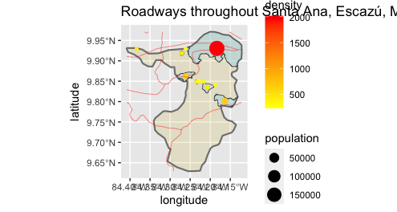
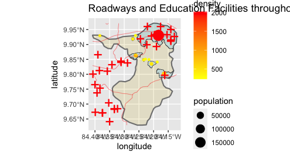
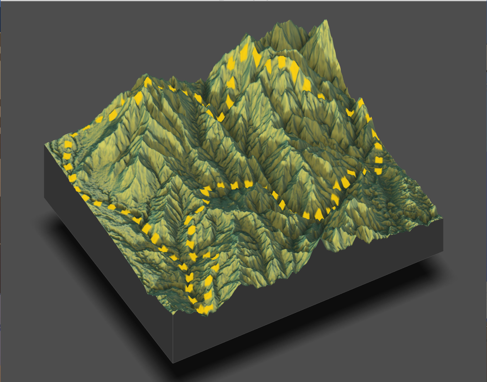

  
  The roadways in this region of Costa Rica (which encompasses Santa Ana, Escazú, Mora, and Acosta, four cantons in the province of San José) tend to be somewhat scarce particularly in Acosta, a much less densely populated area. The focal points of Costa Rica are San José, the capital, and the coastline where the beaches are. From a tourist's standpoint, San José is used mainly for its airport to fly into and then subsequently make your way to the coastline where your resort likely is. Because of this, the roadways generally connect to San José (and therefore go through Santa Ana and Escazú which are closer to San José) and the coast. As for education, the placement of schools and universities (which there are only two of) is based on population as Acosta only has one education facility whereas when you approach San José through Santa Ana and Escazú you encounter eleven education facilities.
  
I had many technical diffitulties during this part of the assignment including having to update and reinstall R and XQuartz, and I'm left with a less detailed three-dimensional topographical plot than I had hoped. While it doesn't include the population density, roadways, and education facilities on it it's still clear when compared with the previous plots how the topography potentially affects the country's development. The most noteworthy observation is that the terrain is extremely mountainous overall, leaving very little choice other than to adapt and create homes, facilities, and roadways throughout it all. As we approach the coastline it becomes more mountainous, and it does similarly as we approach the capital, San José. 
