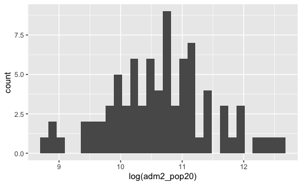
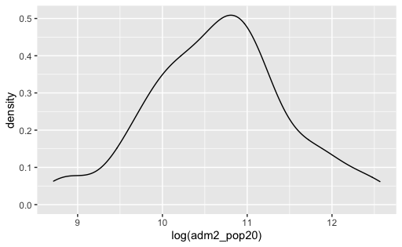
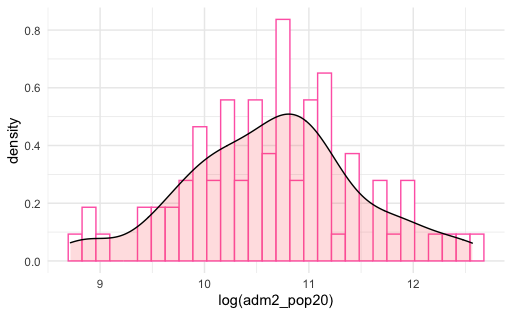
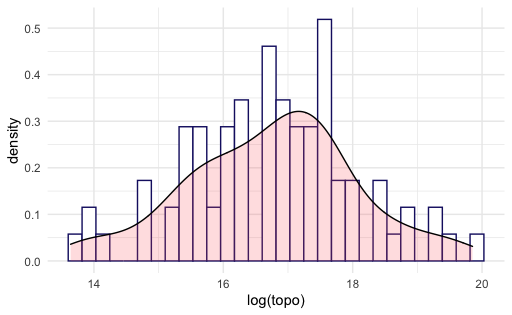

## Project 3 Deliverable

# Below is a histogram of the population count of each administrative region in Costa Rica, which I took the logarithm of.

# Now here is a different plot, but with the same data. It shows population density of each administrative region in Costa Rica, also through a logarithm.

# Here I combine the two to show a comparison in shape.

# Below is the same overlapping histogram plot, but with different variables: Topographical Data and Population Density.

