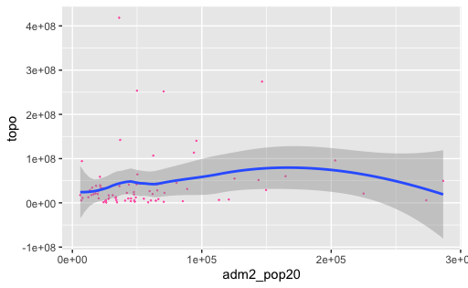

## Project 3 Deliverable

Below is a histogram of the population count of each administrative region in Costa Rica, which I took the logarithm of.

Now here is a different plot, but with the same data. It shows population density of each administrative region in Costa Rica, also through a logarithm.

Here I combine the two to show a comparison in shape.

Below is the same overlapping histogram plot, but with different variables: Topographical Data and Population Density.

Here I've created a Regression Line model comparing topography in Costa Rica and the population density of each second administrative region. The R-Squared value is 0.0, which essentially means there is no relationship between topography and population in Costa Rica. To me, this is surprising because Costa Rica is a very mountainous terrain and I would expect more people at lower elevations and fewer people at high elevations. But, I suppose that because Costa Rica is *so* mountainous that there is no room for preference, and people are relatively equally scattered.

Now I add the variables Urban Cover and Bare Cover to the reggression model, and still obtain an R-Squared value of 0. This likely for the same reasons.

Finally, I've added each variable from the lulc file and plotted the regression line. The R-Squared value is now .8, which is a much higher coorelation now that we've added new factors/varibles to the mix. 

