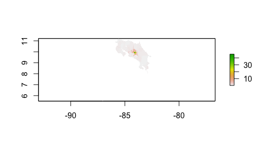
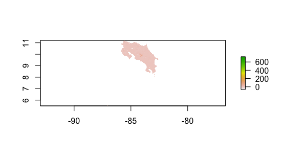
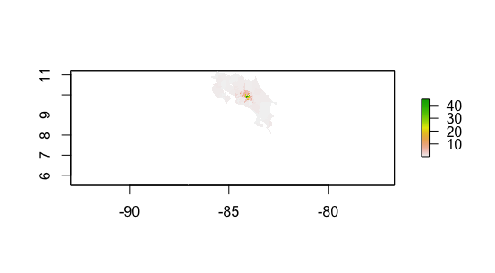
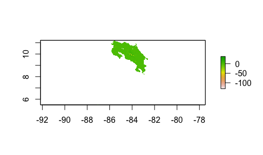
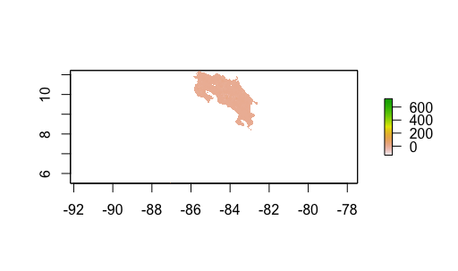
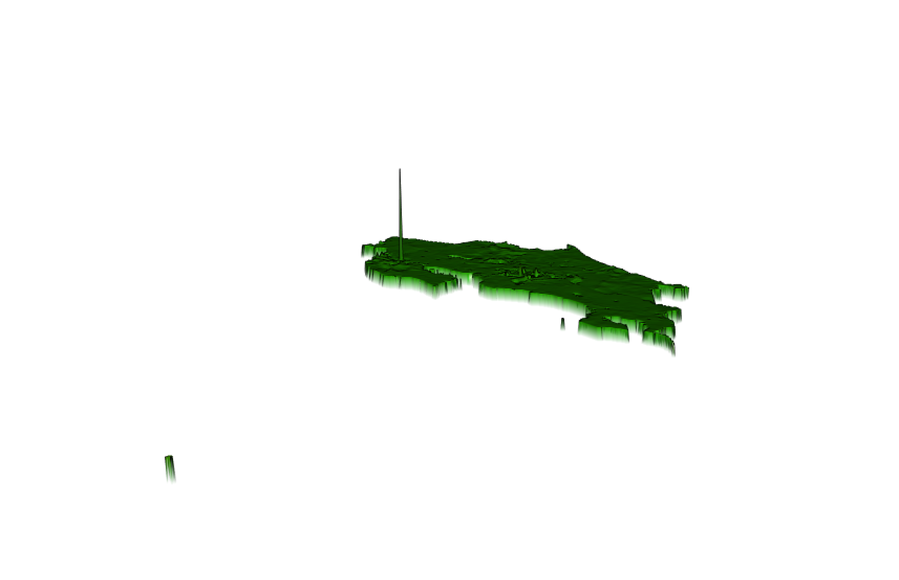
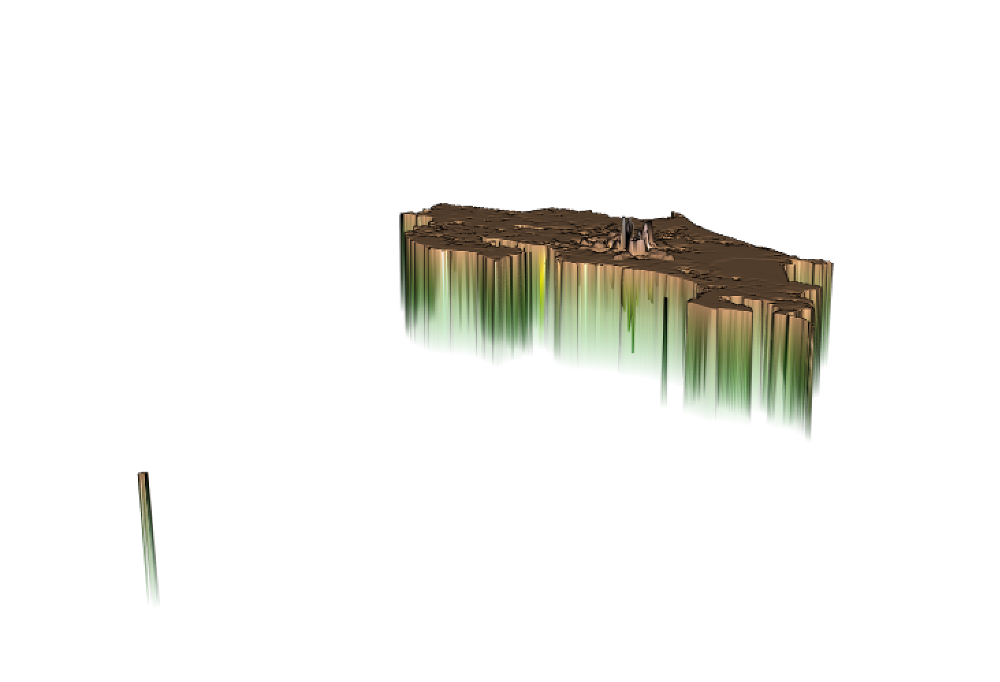

## Project 4 Deliverable

# Population Sums

# Population Means

# Logarithmic Population

# Difference in Population Sums

# Difference in Population Means

# Difference in Logarithmic Population
!

